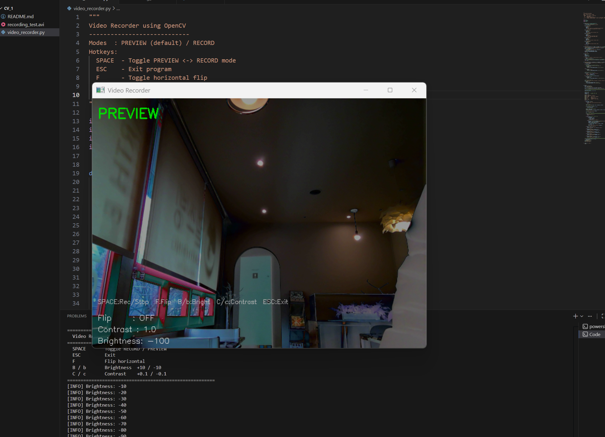

# 📹 IrisRecorder: Interactive OpenCV Video Recorder

> OpenCV를 활용하여 실시간 필터 적용 및 영상 녹화 기능을 제공하는 스마트 비디오 레코더입니다.  
> 이 프로젝트는 컴퓨터 비전 기초 라이브러리 활용 능력을 증명하기 위해 제작되었습니다.

---

## 📌 프로젝트 소개

IrisRecorder는 Python과 OpenCV로 제작한 실시간 비디오 레코더입니다.  
웹캠 또는 IP 카메라(RTSP)를 연결해 미리보기 화면을 확인하고, 원하는 순간에 바로 녹화를 시작/정지할 수 있습니다.  
또한 밝기, 대비, 좌우 반전 필터를 실시간으로 적용할 수 있어 시연 및 과제 제출용으로 직관적이고 활용도가 높습니다.

---

## ✨ 주요 기능

| 기능 | 설명 |
|---|---|
| 🎥 실시간 미리보기 | 카메라 영상을 즉시 화면에 표시 |
| ⏺️ 녹화 시작/정지 | `SPACE` 키로 PREVIEW ↔ RECORD 전환 |
| 🔴 녹화 상태 표시 | 녹화 중 빨간 원 + `REC` 오버레이 표시 |
| 💾 자동 파일 저장 | `recording_YYYYMMDD_HHMMSS.avi` 형식 저장 |
| 🌐 IP 카메라 지원 | `--source`에 RTSP 주소 입력 가능 |
| 🔄 좌우 반전 | `F` 키로 ON/OFF |
| ☀️ 밝기 조절 | `B`(증가), `b`(감소) |
| 🔆 대비 조절 | `C`(증가), `c`(감소) |
| 🎛️ 코덱/FPS 설정 | `--fourcc`, `--fps` 옵션 제공 |

---

## ⌨️ 키보드 조작법

| 키 | 동작 |
|:---:|---|
| `SPACE` | 🔴 녹화 시작 / ⏹️ 녹화 정지 |
| `ESC` | 프로그램 종료 |
| `F` | 🔄 좌우 반전 ON/OFF |
| `B` | ☀️ 밝기 +10 |
| `b` | ☀️ 밝기 -10 |
| `C` | 🔆 대비 +0.1 |
| `c` | 🔆 대비 -0.1 |

---

## ⚙️ 실행 옵션

| 옵션 | 기본값 | 설명 |
|---|---|---|
| `--source` | `0` | 카메라 번호 또는 RTSP 주소 |
| `--fps` | `30.0` | 녹화 프레임 속도 |
| `--fourcc` | `XVID` | 저장 코덱 (`XVID`, `MJPG`, `MP4V`, `H264`) |
| `--width` | `640` | 가로 해상도 |
| `--height` | `480` | 세로 해상도 |

---

## 🖼️ 스크린샷

| PREVIEW 화면 |
|  |

---

### 🎬 데모 영상
- [녹화 테스트 영상 보기 (recording_test.avi)](./recording_test.avi)
*위 링크를 클릭하면 저장된 녹화 파일을 확인할 수 있습니다.*
---

## 🛠️ 기술 스택

- Python 3.8+
- OpenCV (`cv2.VideoCapture`, `cv2.VideoWriter`, `cv2.convertScaleAbs`, `cv2.flip`)

---

---

## 📄 라이선스 (License)

이 프로젝트는 **MIT 라이선스**를 따릅니다. 자세한 내용은 [LICENSE](./LICENSE) 파일을 확인하세요.

Copyright (c) 2026 김예중
